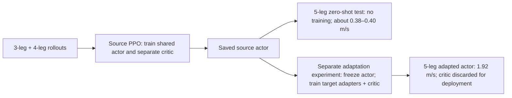
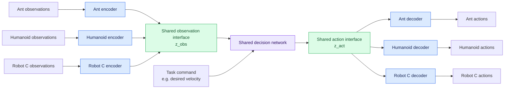
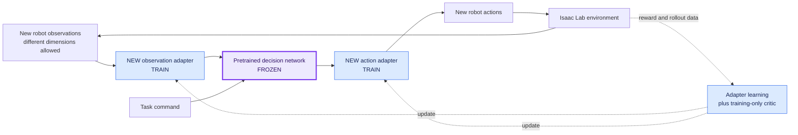
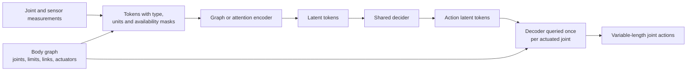
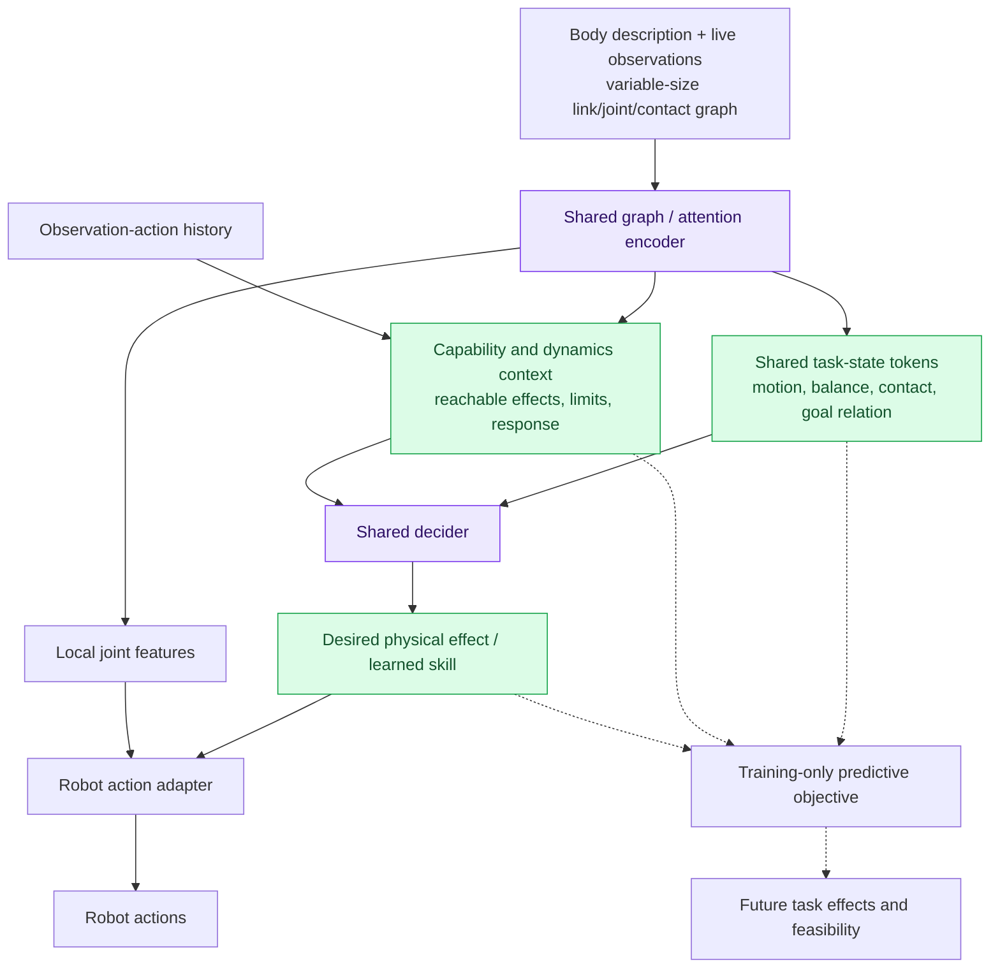

# Cross-embodiment control through a frozen shared policy

Created and updated: 2026-10-01. Status: infrastructure, symmetric Ant variants, specialist baselines, shared graph source training, zero-shot evaluation and an initial adapter-transfer pilot completed.

## Current experiment and results

The concrete experiment is to train one shared actor on three- and four-legged Ants, then test it on a five-legged Ant excluded from source training. Keep two questions separate:

1. **Zero-shot generalization:** run the saved source actor on five legs without updating any weights or statistics. This directly answers whether source training transfers immediately.
2. **Adaptation:** allow five-legged simulator experience to train small observation/action adapters while the source actor stays frozen. The user allowed this setting earlier; its results must be reported separately from zero-shot generalization.

Both have now been exercised. All measurements below are initial single-seed results, not established transfer advantages.

| Experiment | Five-leg training used? | Result |
|---|---|---|
| Shared source actor trained on 3/4 legs | No | Source speeds: 1.532 / 2.251 m/s |
| Same actor evaluated on 5 legs | **No** | **0.398 m/s**, 64/64 time-limit survival; later initial-policy evaluations were 0.377–0.382 m/s |
| Frozen pretrained actor + target adapters | Yes: 200 PPO updates | **1.917 m/s**, 64/64 survival; 1,498 trainable actor parameters |
| Frozen random actor + target adapters | Yes: same target budget | 0.452 m/s, 64/64 survival |
| Graph actor trained from scratch on target | Yes: same target budget | 1.989 m/s, 64/64 survival |
| Entire source actor fine-tuned on target | Yes: same target budget | 1.540 m/s, 64/64 survival |

The target comparisons each used 1,024 worlds × 32 steps × 200 updates = 6.5536 million target transitions. Source pretraining used 32.768 million source transitions. At 101 target updates, adapters reached 1.619 m/s versus scratch 0.436 m/s; scratch caught up by the final budget. The five-legged MLP specialist reached 5.611 m/s at a different, larger 500-update budget and is a separate learnability reference.

**Actor versus critic:** the actor maps observations to motor actions. PPO's critic predicts expected future reward and supplies a baseline for the actor's learning signal; it does not control the robot. Source training learns a shared graph actor and a separate shared graph critic from the 3/4-leg trajectories. Zero-shot testing needs only the frozen actor and does not train a five-leg critic. Target adaptation trains a fresh, separate critic alongside the adapters, while all source actor weights, normalization buffers and exploration scale stay frozen. The critic can be discarded for deployment. Every target condition trains a 27,617-parameter critic, reported separately from the actor counts.



Implemented architecture: physical joint graphs, a shared 64-channel encoder with two message stages, masked pooling, a 32-D decision latent and a shared per-joint decoder. Three/four/five legs produce six/eight/ten effort outputs with the same base parameters. The decoder sees local graph features as well as the global latent. This prototype supports the two-joint-per-leg Ant family; it does not yet establish arbitrary-topology or abstract-dynamics transfer. Zeroing the decision latent reduces adapted speed to 0.0106 m/s, showing dependency but not proving physical semantics.

Infrastructure supports independent ordinary policies with skrl and RSL-RL, multiple noninteracting robots in one cloned world, separate resets/rewards and correct timeout bootstrapping. Three- and five-legged assets were corrected to evenly spaced radial branches and retrained. A contact audit confirmed the conventional five-leg specialist carries its front-facing leg despite active motors; the user accepted that gait with unchanged mechanics/reward.

See [MULTI_ROBOT_TRAINING_ARCHITECTURE.md](MULTI_ROBOT_TRAINING_ARCHITECTURE.md) for the code map, validation, commands, exact checkpoints, videos and detailed metrics. These two Markdown files are now version-controlled research records at the user's request. Large/generated artifacts and scratch helpers under `logs/` remain ignored and local; a fresh clone will contain the written results and commands, but not those checkpoints, videos or plots.

## How to read the design proposals below

The following sections preserve the original rationale, literature and alternatives. The current implementation above supersedes proposed defaults where they differ. Broader dynamics abstractions, history models, morphology-diversity studies and multi-seed comparisons remain research work. The session log records the order of completed milestones.

## Agreed direction

Train several robot embodiments jointly, with robot-specific observation encoders and action decoders surrounding a shared decision network. On a robot excluded from pretraining, freeze the shared network and train only small observation/action adapters.

**User-confirmed scope:** small target adapters are allowed with a frozen shared actor. The user subsequently emphasized the direct 3/4-to-5-leg generalization question; report the zero-shot result first and distinguish every target-trained comparison explicitly.

Ant, humanoid, and other robots are motivating examples, not a finalized training set. “At the same time” means learning a common controller from multiple robot rollout streams; the robots need not interact in the same scene. This is multi-embodiment learning, not necessarily multi-agent RL.

Working research question:

> Does joint pretraining across diverse bodies produce a frozen decision network that reduces the interaction data needed to learn control of a new body, using small adapters?

My assessment: worthwhile and technically plausible, but the broad encoder–shared-policy–decoder idea has close prior art. The contribution must be an experimentally demonstrated improvement, a useful training method, or a stronger transfer setting.

## Architecture A: the proposed starting point



Each rollout follows its own encoder and decoder. Arrows merging into the shared interface mean common dimensions and shared weights; they do not mean concatenating simultaneous observations from all robots.

For robot r, a first actor can be written as:

```text
z_obs = E_r(observation history)
z_act = P_shared(z_obs, task command)
action mean = D_r(z_act)
action ~ robot-specific Gaussian(action mean, learned standard deviation)
```

The Gaussian is defined in the robot's action space. This makes PPO action probabilities straightforward. Initially z_act is a deterministic learned feature vector, not a sampled latent with an intractable decoded action density. A true stochastic latent-action policy is a later design choice requiring a consistent training objective.

Start with a strict decoder that sees z_act only. Later compare a small decoder with local joint-state feedback, D_r(z_act, local_state). Feedback may help a decoder execute reusable motor intentions, but also allows it to bypass the shared network. Keep this an explicit ablation.

“Shared latent space” initially means a shared interface. It does not establish that latent coordinates have common behavioral meaning across robots.

## New robot adaptation



Freeze the shared network's parameters and mutable statistics. Still allow gradients through its operations into the new encoder; detaching its output would prevent the intended encoder learning. New adapters and a training-only target critic learn. The implemented pilot also freezes the source exploration scale; learning target exploration is a possible later variant. Report actor-adapter and critic parameter counts separately.

Initial proposal: learn adapters using simulator interaction and the same task reward family as pretraining. This assumes access to target rewards; it is a proposed experimental setting, not a user requirement. Reward-free adaptation is a separate, harder comparison motivated by the closest prior work.

This should be described as adaptation to a robot unseen during pretraining. Once its adapters are trained, the complete controller has seen target data; it is not zero-shot deployment.

## Networks worth considering

| Component | First experiment | Later alternative and motivation |
|---|---|---|
| Observation adapters | Small MLPs with robot-specific normalization | Graph networks or attention over joint/sensor tokens for variable topology |
| Shared decider | MLP; include a short observation history at the input | GRU for memory or Transformer when variable-length tokens/history justify it |
| Action adapters | Small MLPs to action means | Shared per-joint decoder or graph decoder, optionally with local feedback |
| Training critic | Separate critic per source robot | Shared critic conditioned on morphology if it improves efficiency |
| Latent regularization | None initially; measure transfer first | Auxiliary prediction of common task effects; contrastive or dynamics losses with justified correspondences |

Illustrative initial sweep, not validated hyperparameters: observation latent 64 or 128; action latent 16, 32, or 64; adapters with one or two narrow hidden layers; shared trunk wider than either adapter. Report actual parameter counts rather than assuming the adapters are small. An action bottleneck need not match any robot's action dimension; too narrow can exclude behaviors needed by complex bodies.

A VAE can regularize an action representation if trajectories are available, but reconstruction alone cannot establish cross-robot alignment. Diffusion/flow models are reasonable later for multimodal action sequences and demonstration-heavy manipulation; they add unnecessary moving parts to the first online locomotion study.

If variable topology itself becomes central, consider this extension:



This can share more adapter structure and support different joint counts. A graph supplies connectivity; a Transformer supplies flexible interaction among tokens. Neither guarantees transfer to arbitrary bodies. Physical descriptors and training diversity still matter. This extension is not required to test the user's chosen adapter-training objective.

## Main risks and how to expose them

1. **The latents do not align.** Encoders can place different robots in disjoint latent regions, and the shared network can learn separate behaviors. Matching dimensions or marginal distributions does not fix this. First test held-out transfer, then compare effect-based supervision: predict normalized changes in body velocity/orientation from z_obs and z_act. Avoid claiming exact dynamics equivalence between bodies with different feasible motions.
2. **Adapters learn the entire task.** Limit capacity and compare against an equally sized scratch actor, a frozen random decider, and constant/shuffled z_act. Use both retrained controls and inference-time interventions; an intervention alone can fail simply because it is out of distribution. State-conditioned decoders need particularly careful controls.
3. **A common representation discards necessary information.** Joint state, contacts, actuator limits, and body capabilities matter. Common task coordinates can coexist with morphology-specific detail. Do not force all embodiment information out of the representation.
4. **Tasks differ more than the bodies.** Begin with a single task family. A quadruped and a humanoid can both track body velocity, but their stable motion and contact strategies differ. Universal locomotion-to-manipulation transfer is a much broader ambition.
5. **One robot dominates learning.** Balance sampling and loss contributions across embodiments. Normalize observations per robot and inspect reward/value scales and per-robot learning curves. Raw pooled return can hide a failing robot.
6. **Missing observations remove necessary information.** A new ordering or joint count is different from losing state information or adding an unseen sensor modality. Use typed features, masks, and history where appropriate. Missing-sensor robustness needs separate training and evaluation.
7. **New bodies require unavailable behaviors.** A frozen trunk may not contain useful structure for a much more distant body. Compare full fine-tuning and measure transfer versus morphology distance; adapter-only failure can reveal a real limitation.

A useful analogy: the shared network should represent reusable decisions, while adapters translate perception and execution. Whether it actually learns that division of labor is the scientific question.

## Related work and positioning

Targeted literature scan on 2026-10-01; not an exhaustive novelty review. Paper results below are author-reported, not independently reproduced here.

| Work | Relevance | Boundary to keep in mind |
|---|---|---|
| [NerveNet: Learning Structured Policy with Graph Neural Networks](https://www.cs.toronto.edu/~tingwuwang/nervenet.html), 2018 | Encodes body structure as a graph for continuous control and studies structural transfer. | Useful topology-aware baseline; does not establish the proposed frozen latent-interface result. |
| [One Policy to Control Them All: Shared Modular Policies](https://arxiv.org/abs/2007.04976), 2020 | Reuses actuator-level modules with message passing across different skeletons. | Demonstrations include planar locomotion and unseen variants, not unrestricted robot generality. |
| [MetaMorph](https://arxiv.org/abs/2203.11931), 2022 | Morphology-conditioned Transformer controller, with unseen-morphology and fine-tuning results. | Universal-controller baseline in a modular robot design space. |
| [Universal Morphology Control via Contextual Modulation](https://proceedings.mlr.press/v202/xiong23a.html), 2023 | Uses morphology-conditioned hypernetworks and attention modulation. | Motivates conditioning shared computation on the body rather than demanding full invariance. |
| [Cross-Embodiment Robot Manipulation Skill Transfer using Latent Space Alignment](https://arxiv.org/abs/2406.01968), 2024 | Closest architectural match: shared state/action latents, fixed latent policy, learned target encoders/decoders. | Manipulation transfer uses target data and alignment losses without target task reward. Do not interpret its use of “zero-shot” as no target adapter training. |
| [Latent Action Diffusion for Cross-Embodiment Manipulation](https://arxiv.org/abs/2506.14608), 2025 preprint, revised 2026 | Contrastive alignment of end-effector actions supports a shared latent diffusion policy. | Relevant action-space design; evidence concerns manipulation, not Ant-to-humanoid locomotion. |
| [Learning a Unified Latent Space for Cross-Embodiment Robot Control](https://arxiv.org/abs/2601.15419), 2026 preprint | Shared humanoid motion representations and lightweight embeddings for adding robots. | Another close connection; inspect target-robot training and motion/control assumptions before comparing claims. |

Read the 2024 latent-alignment paper first, then MetaMorph and Shared Modular Policies. A possible contribution is **multi-source locomotion pretraining that measurably improves adapter-only transfer across held-out body topologies**, with controlled evidence that the frozen shared network matters. This is a candidate research claim, not an established novelty claim.

Other hypotheses to test later: whether predictable task effects improve latent portability; whether source-body diversity helps more than extra samples from one body; whether a compact action latent transfers better than direct per-joint features.

## Isaac Lab starting points and integration plan

Inspected in the current checkout:

- `source/isaaclab_tasks/isaaclab_tasks/core/locomotion/ant/ant_direct_env_cfg.py`: Ant direct configuration currently declares 60 observations and 8 actions.
- `source/isaaclab_tasks/isaaclab_tasks/core/locomotion/humanoid/humanoid_direct_env_cfg.py`: Humanoid direct configuration currently declares 87 observations and 21 actions.
- `source/isaaclab_tasks/isaaclab_tasks/core/velocity/velocity_env_cfg.py`: reusable velocity-tracking configuration, including commands, rewards, observations, and joint-position actions; robot configurations include G1 and Cassie under `core/velocity/config/`, with other robots under `contrib/velocity/config/`.

The Ant/Humanoid configs are useful shape-mismatch examples. They have distinct reward scales and walking-target configurations; do not treat raw returns as directly comparable or assume they already implement a standardized command-tracking benchmark. Choose and verify action semantics before combining tasks.

Original integration proposal (the actual implementation uses multiple named articulation batches in one shared simulation; see the architecture document):

1. Robot/task manifest: splits, observation definitions, units, action semantics, control rate, command distribution, actuator and reset settings.
2. One homogeneous vectorized rollout pool per embodiment, potentially in separate processes. A learner receives their batches and applies balanced updates. Avoid relying initially on heterogeneous robots inside a single cloned articulation batch.
3. Actor registry for observation adapter, shared trunk, action adapter, normalization, and exploration parameters. Keep separate checkpoint ownership for frozen and adaptable parts.
4. PPO integration with actual robot-action log probabilities, valid-dimension handling, training critics, and synchronous policy versions for on-policy collection. Variable-size batches can remain grouped by robot rather than padded.
5. Target adaptation runner with explicit frozen parameters/statistics and a fresh target critic.
6. Evaluation runner reporting target interaction budgets, seeds, performance, parameter counts, and pretraining cost.

These are proposed integration choices, not an assertion that the stock trainer already supports heterogeneous batches or simultaneous independent simulator instances. Verify the chosen runner and backend before implementing. This is Isaac Lab task/training research; no Isaac Sim extension or standalone library is needed for the initial experiment.

The implemented runs use flat ground, Newton MJWarp on an RTX 4090 (24 GB), a 1/120 s physics timestep and decimation 2 (60 Hz control), with effort actions. Training/evaluation budgets and measured run times are recorded in the architecture document. Backend transfer remains a separate experimental variable.

## Experiments and milestones

### 0. Lock the evaluation contract

- [x] Choose adapter-only target training with the shared policy frozen.
- [x] Confirm initial task family: Ant flat-ground forward-progress locomotion with existing proprioception/joint-wrench observations; this is not a commanded-velocity tracking benchmark.
- [x] Choose the initial source/target split: 3/4-leg sources, 5-leg target, with target data excluded from source training.
- [ ] Define separate development bodies and additional held-out targets before broader hyperparameter tuning.
- [x] Define pilot adaptation data access: simulator interaction plus the unchanged locomotion reward.
- [x] Record pilot budgets: 500 source updates; 200 target updates per comparison; 1,024 worlds and 32 control steps per update.
- [ ] Set a preregistered performance threshold and multi-seed protocol for stronger comparative claims.

Keep the final held-out bodies out of pretraining, normalization fitting, and hyperparameter selection. They are exposed only at the declared adaptation/evaluation stage. Use separate development targets to tune adaptation.

### 1. Establish that each task works (initial specialists completed)

- Train independent specialist policies on the proposed source robots.
- Standardize the task meaning, observation units, and action contract where feasible.
- Verify each robot can solve its task before interpreting joint-training failures.
- Start with a few related bodies, then add different joint counts/connectivity. Ant and humanoid can be a later broad-gap comparison rather than the only two source bodies.

### 2. Train the minimal shared model (graph pilot completed)

- Implemented: train a shared graph actor and separate graph critic with balanced 3/4-leg trajectories. Morphology-specific MLP heads remain an alternative architecture.
- Compare source performance with specialists and inspect each robot separately.
- Try a small latent-size and adapter-capacity sweep.
- Save a complete pretraining checkpoint and a frozen-trunk export.

### 3. Run zero-shot and adaptation tests (initial comparisons completed)

Evaluate the unchanged source actor on the target before training. Separately train target adapters against the frozen actor and plot performance versus target environment transitions. The initial scratch/random-frozen-actor/full-fine-tuning controls are complete; one-source and narrower decoder comparisons below remain open:

| Baseline | What it tests |
|---|---|
| Target specialist trained from scratch | Whether pretraining saves target interaction data |
| Same factorized architecture trained from scratch | Whether the architecture alone explains improvements |
| New adapters around a frozen random trunk | Whether learned shared weights matter |
| Full fine-tuning of the pretrained architecture | Cost of freezing and a practical alternative |
| Pretraining on one source body at matched source steps | Whether multiple bodies improve transfer |
| Restricted local-feedback decoder and z_act controls | Whether action adapters bypass shared decisions |

Report trainable and total parameters, source and target samples, wall-clock time, and identical target task/data access. Exact parameter matching may require separate baselines; document mismatches instead of presenting them as controlled.

### 4. Identify why transfer succeeds or fails

- Compare pure RL with task-effect prediction or other justified alignment objectives.
- Compare flat MLP interfaces with graph/token adapters.
- Separate altered dimensions, changed topology, different dynamics, and missing sensors in the test matrix.
- Investigate whether one body or many bodies provide the useful pretrained structure.

### 5. Broaden only after a positive result

- Add more morphology families and systematic held-out topology tests.
- Add sensor availability variation, rough terrain, and richer commands separately.
- Consider reward-free adaptation or descriptor-generated adapters as distinct follow-up projects.

## Metrics and criteria

Primary outcomes: target steps to a predefined performance threshold and area under the target learning curve. Also report final velocity-tracking error, fall rate/episode survival, action/energy costs where comparable, and performance per robot. Prefer physical task metrics over averaging incompatible raw rewards.

Use at least three seeds for exploratory conclusions; increase replication when a claimed effect is small or variable. Report variability and failures. Show total pretraining cost separately, and whether it amortizes over multiple new robots.

Proceed toward a transfer claim only if pretrained frozen-trunk adapters improve target learning over scratch and frozen-random controls across multiple held-out bodies. Success on source robots alone establishes joint training, not transfer. A latent visualization alone does not establish shared semantics.

If full fine-tuning helps but adapters do not, inspect the bottleneck/capacity and whether freezing excludes needed behavior. If random frozen trunks work equally well, the present experiment does not demonstrate useful pretrained decision structure.

## Open decisions for the next session

- Exact locomotion task and first robot set.
- Target training budget and available GPUs.
- Whether limited joint-state feedback belongs in the action adapter.
- Whether reusable low-level skills or reusable task-level decisions are the intended contents of z_act; begin at one control rate and treat temporal hierarchy as a later experiment.
- Which prior-work implementation and training code are practical starting points after a focused code review.

## Research thread: observations and dynamics across different topologies

Added 2026-10-01 after the user referenced [Neural Robot Dynamics (NeRD)](https://arxiv.org/html/2508.15755). This explores a representation alternative; it does not replace the agreed frozen-policy/learned-adapter objective or commit us to an implementation.

### What NeRD contributes

NeRD learns robot-specific dynamics. Its useful representation choices are robot-frame states, gravity expressed in that frame, contact geometry, and applied joint torques, with temporal history. It retains analytical collision detection and controller conversion. Its spatial invariance concerns translation and rotation around gravity with consistent scene transformations. Its demonstrations across several robots use separate robot models; they do not establish one topology-independent latent dynamics model. For us, the lesson is to encode physically meaningful interactions and remove irrelevant coordinate choices.

### Three distinct meanings of independence

| Desired property | Meaning | What it does not establish |
|---|---|---|
| Independence from enumeration | Relabeling links/joints leaves a global code unchanged and reorders per-link outputs consistently. | Rewiring joints leaves behavior unchanged. |
| Architecture accepts new topology | Shared graph/token operations handle varying body graphs and sizes. | Generalization to all graphs or identical physical behavior. |
| Shared behavioral abstraction | Different states/bodies map together when corresponding actions have comparable task consequences. | All bodies can realize every action in the abstract space. |

The recommended target is a topology-agnostic interface with topology-aware encoding. Connectivity should enter as data rather than being embedded in fixed input/output layer dimensions. Compress physical consequences of morphology instead of deliberately erasing them.

### Proposed representation: local structure, shared state, and capability context

Build a typed graph with links as nodes and joints as edges; add contacts or nearby surfaces as interaction tokens/edges. Equivalent joint-node formulations are possible. Use shared encoders per feature type, not a distinct embedding learned for every joint name.

| Input group | Example features |
|---|---|
| Link | Relative pose, linear/angular velocity, mass, inertia, geometric scale |
| Joint/actuator | Type, axis and attachment transforms, position/velocity, limits, effort/speed limits, actuator mode and available parameters |
| Contact/surface | Relative location, normal, separation, relative velocity, measured/estimated contact state |
| Global | Gravity direction, task command, control timestep, relevant terrain/goal context |
| History | Recent observations and actions, with timing, availability masks, and explicit action semantics |

Use a consistent robot reference frame and transform goals, vectors, contacts, and history consistently. Retain gravity and task-relevant terrain height; removing global translation is not permission to remove distance to the ground. Arbitrary roll/pitch is not an invariance if gravity is held fixed. Optional dimensionless scaling with characteristic mass/length/time improves numerical comparability, but cannot make arbitrary robots dynamically equivalent.

Robot descriptions provide initial physical attributes. Friction, actuator response, payload, delay, and other uncertain dynamics may require history. Simulator-only quantities can supervise learning but must not silently become required deployment observations. Specify known, measured, estimated, and privileged-only inputs separately.

Message passing along joints models local coupling. Global attention can convey long-range coordination without requiring a number of message-passing layers equal to the body's diameter. Attention pooling with a fixed set of learned queries can produce K latent tokens independent of joint count. This supplies a fixed interface, not guaranteed sufficient information; compare it with a variable-size token interface and avoid collapsing everything to a single mean.



The proposed split is conceptual: task state answers “what is happening?” and capability context answers “how can this body change it?” The split will not become identifiable merely by assigning two output heads. Supervise physical effects, vary morphology/dynamics during training, and test each component's necessity. Local decoder feedback changes the strict bottleneck baseline and retains the bypass risk described above.

### A physical abstraction to test for locomotion

Centroidal motion provides a common description: center-of-mass motion and total angular momentum. In an inertial frame, with uniform gravity and contact as the only other external wrench:

```text
m * c_ddot = m * g + sum_i f_i
L_dot = sum_i ((p_i - c) cross f_i + contact_moment_i)
```

Here c is center of mass, L is angular momentum about c, and p_i/f_i are contact locations/forces. These equations have the same form across articulated bodies. Body-specific constraints determine achievable forces and motions. Centroidal state alone omits internal configuration and future contact reachability. See [Centroidal dynamics](https://pure.kaist.ac.kr/en/publications/centroidal-dynamics-of-a-humanoid-robot/) and [Whole-body motion planning with centroidal dynamics and full kinematics](https://dspace.mit.edu/entities/publication/eafd7d09-bc5d-4c2f-9ee1-4c5a9334fad7).

Proposed learned addition: represent reachable task effects over a specified horizon, conditioned on current configuration, contacts, and actuator limits. Examples are attainable body acceleration, turning response, and contact placement. Two bodies can share an effect coordinate system while having different feasible regions in it. Contact/support summaries alone are not a complete dynamic balance criterion.

### Dynamics abstraction also requires action abstraction

For embodiment r, observation history h, and shared abstract command u, the intended approximate relationship is:

```text
z_t, b_t = E(h_t, body_graph_r)
a_t = D_r(h_t, u_t)
z_(t+H) approximately follows F(z_t, b_t, u_t, H)
u_t belongs to the body's feasible effect set U_r(h_t, H)
```

For H greater than one, D_r denotes a closed-loop execution policy over that interval. Freeze it or account for its changes when interpreting learned dynamics. A shared observation code with raw robot-specific motor actions does not by itself define common transition semantics.

First define a few observable effects, such as velocity and yaw-rate changes over a fixed physical horizon. Train an auxiliary predictor of these effects from encoded state and actual action/abstract-command information. Prediction can shape an actor representation without replacing the simulator or deploying model-predictive control. Predicting immediate state alone can reward trivial near-identity copying; use multiple horizons and control-relevant changes.

For stronger behavioral alignment, states should be close when corresponding feasible abstract commands produce similar future effects and task outcomes. This is related to [bisimulation-based representation learning](https://arxiv.org/abs/2006.10742), but cross-embodiment application requires an action correspondence and feasibility handling. That paper does not establish this construction for arbitrary robots. Avoid enforcing similarity only because velocities or marginal latent distributions happen to match.

Useful additional precedents: [graph networks for learned physics and control](https://proceedings.mlr.press/v80/sanchez-gonzalez18a.html) motivate reusable local computation; [RMA](https://arxiv.org/html/2107.04034) motivates inferring dynamics context from observation/action history, but studies adaptation on a fixed quadruped embodiment rather than topology transfer.

### Smallest discriminating study

Compare three encoders with the same shared-policy/adapter transfer protocol:

1. Flat robot-specific MLP adapters from the original baseline.
2. Graph/token encoder with physical descriptors and common frame conventions.
3. The same structured encoder plus capability/history context and task-effect prediction.

Keep downstream capacity and source data budgets comparable. Hold out topology changes, not just robot names or random states. Measure target adapter sample efficiency, held-out effect prediction error, and degradation when capability information is removed. Check link-index permutation consistency separately from topology transfer. A full simulator-quality world model is not necessary to test this hypothesis.

Working hypothesis: a shared description of motion plus a learned description of achievable changes transfers better than either joint-indexed vectors or a latent forced to hide all body information. This remains a proposal requiring experiments.

## Candidate first experiment: three- and four-legged Ant to five-legged Ant

User proposal, 2026-10-01: train a standard Ant and a three-legged variant together with no physical interaction, then evaluate transfer to a five-legged variant. This is now implemented using the radial v2 variants, a stock four-leg control and the graph/PPO budgets summarized above.

### Assessment and interpretation

This minimal experiment now supports both questions: immediate zero-shot transfer with the fully shared graph actor, and subsequent adapter learning with the actor frozen. Zero-shot evaluation requires no new target output layer in this architecture. An untrained morphology-specific head would be a different setting and cannot be used as evidence against the fully shared graph design.

Three/four to five legs tests extrapolation to a larger body graph and different coordination. It does not establish arbitrary-topology transfer. Two source bodies can still be memorized. Establish a specialist policy for each morphology and use multiple training/evaluation seeds; later vary attachment angles, segment lengths, or which leg is absent within source families to test whether diversity improves transfer.

If every leg keeps the standard Ant's two actuated joints, three/four/five legs imply 6/8/10 motor outputs. Modified assets must actually remove/add physical links and joints. Disabling a leg's motor leaves a different mechanical system. “Remove one of four legs” and “three evenly spaced legs” are distinct morphology choices; similarly, adding a fifth leg and redistributing all five attachments change different factors. Record attachment geometry, body mass, limb mass, actuator strength, and self-collision choices. Verify stable initialization and learnability before interpreting transfer failures.

### Two noninteracting robots per scene

The user-proposed layout is reasonable: each cloned scene contains one three-legged and one four-legged articulation, with robot–robot collisions excluded and sufficient separation. Both must still collide with the ground. Repeat that pair across many scene copies for throughput.

The learner should treat each robot as an independent trajectory with its own observations, reward, termination, timeout, history, and reset. With N paired scenes there are 2N logical robot trajectories. Keep graph communication and attention within each robot. A common task-command distribution is appropriate; concatenating both robots' observations or summing their rewards into a single joint control problem changes the experiment.

A pair of homogeneous rollout pools feeding one learner is an alternative with equivalent learning intent. Physical pairing is an implementation choice, not the cause of knowledge sharing. Balance source contributions to shared updates.

The inspected stock Ant direct task has one named articulation and one reward/done/reset stream per scene, with eight actions and a flat observation vector. Its parent `core/locomotion/locomotion_direct_env.py` drives joint efforts. A paired task requires explicit scene and rollout/reset integration; placing a second asset in the scene is not sufficient. The paired implementation and reset/contact/runner validation are now complete in `contrib/multi_robot_locomotion`; see the architecture record.

### Decoder ownership and graph interpretation

Weights belong to the policy or morphology, never to an individual environment copy. All four-legged Ant copies share the same applicable weights; their state, latent activations, action samples, and recurrent memory are separate.

Two valid designs should be distinguished:

| Design | Source training | Five-legged target |
|---|---|---|
| Morphology-specific adapters around shared P | Train E3, D3, E4, D4, and P jointly | Freeze P; train small E5/D5. This directly matches the agreed adapter-only transfer objective. |
| Shared graph encoder and per-joint decoder | Train E, P, D across both source graphs, using physical features instead of learned joint IDs | The existing network produces ten outputs without a new output layer; measure zero-shot behavior, then adapt small input/output modules with P frozen. |

The second design was selected for the implemented pilot. It freezes the complete source actor (E/P/D, normalization and exploration) and learns small residual target input/output adapters. The first design remains an unimplemented architectural comparison.

A decoder can operate on the existing body graph; it need not generate a graph. For each actuated joint j:

```text
h_j = graph encoder's contextual feature for joint j
u_r = shared decider's latent for this particular robot observation
action_mean_j = shared small decoder(u_r, h_j, joint_descriptor_j)
```

The same decoder function is applied 6, 8, or 10 times. A second message-passing stage is optional. A shared MLP per joint can suffice initially because h_j already contains graph context. The joint descriptor identifies location/axis/limits through physical attributes. Broadcasting u_r without distinct joint features would give identical outputs and cannot coordinate different joints. Convert each normalized output into the configured motor command, respecting joint ordering and actuator limits.

Local graph features at the decoder can bypass the global latent, as noted earlier. Keep capacity small and compare with constant/shuffled latents and a frozen random decider. Variable output size alone does not demonstrate reusable decisions or an aligned action space.

### Execution order (initial single-seed pilot completed)

1. Create and validate the physical variants; show each can learn the same locomotion task independently.
2. Jointly train the three- and four-legged source policies with balanced batches.
3. For a fully shared graph actor only, evaluate the frozen actor on five legs before target training.
4. Run the separate adaptation experiment: freeze the complete shared actor and train target observation/action adapters.
5. Compare target learning curves with scratch, frozen-random core, and full fine-tuning. Report target steps, physical tracking/survival metrics, and seeds.

Five-legged specialist training is a learnability baseline; isolate its data and checkpoints from source pretraining and adapter initialization. Use development morphologies for tuning and reserve separate target evaluation episodes/seeds. Assets, training code and initial comparisons are now implemented; multi-seed replication and broader morphology validation remain open.

## Session log

All milestones below occurred on 2026-10-01, in this order:

1. Defined the encoder/shared-decider/decoder idea, surveyed related work and recorded the user's allowance for small target adapters with a frozen shared policy.
2. Explored topology-independent observations/dynamics, including the NeRD reference, physical graph descriptors, centroidal/task-effect abstractions, capability constraints and history. Those broader abstractions remain proposals.
3. Selected the controlled 3/4-leg source to 5-leg target experiment, with noninteracting robots in each source world and separate zero-shot/adaptation measurements.
4. Built independent multi-robot infrastructure: manifests, selective resets, separate rewards/dones, contact isolation and terminal observations. Validated concurrent ordinary MLP learning with skrl on Ant+Ant and Ant+Humanoid.
5. Added independent RSL-RL PPO, checkpoint resume, playback and per-robot exports; validated learning and the runner/reset/bootstrap contracts.
6. Generated initial asymmetric 3/5-leg assets and trained independent specialists. Recorded all four task families with 64 worlds. These v1 morphology results/videos are historical.
7. Corrected the 3/5-leg geometry to equally spaced radial branches, verified signed physical action responses on every joint, retrained the specialists and supplied replacement 64-world videos.
8. Built the shared joint-graph actor/critic and source PPO path. Validated permutation/padding behavior, variable action counts, shared updates, terminal bootstrapping and checkpoint reload. Trained on 3/4 legs only and evaluated unchanged weights on 5 legs.
9. Investigated the user's repeated fifth-leg concern with ground-contact/load measurements and motor-disable interventions. Confirmed active control but negligible stance contact for the front-facing branch. The user accepted this learned gait; mechanics/reward stayed unchanged. Two additional conventional training seeds completed but were not audited as replacement baselines.
10. Implemented frozen-actor residual adapters and the three target-training controls. Completed the 200-update single-seed comparison, initial/mid/final evaluations, checkpoint resume, exact frozen-tensor checks and decision-latent ablations. Detailed results are above and in the architecture record.
11. Clarified the actor/critic distinction and that the target comparison table includes five-leg training, whereas the original zero-shot result is approximately 0.38–0.40 m/s. No target critic is needed for zero-shot inference.
12. Updated both research documents to reconcile historical proposals with completed work and added them to Git at the user's request. Local generated artifacts remain ignored; multi-seed validation, improved source learning and broader topology/dynamics abstraction remain future work.
