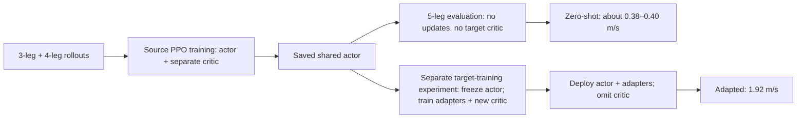
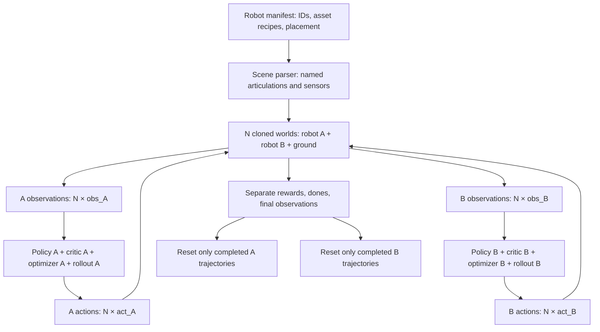
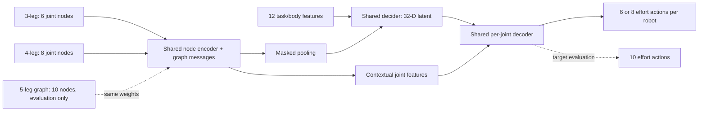
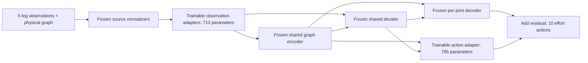

# Multi-robot training infrastructure and cross-embodiment experiments

Updated: 2026-10-01. Branch: `research/multi-robot-independent-training`.

Current state: radial v2 morphology fixes, conventional specialists, replacement videos, the initial shared graph/PPO source policy and the first frozen-actor target-adapter comparison are complete. The user accepted the specialist's carried-front-leg gait after the contact audit below and authorized continuing with the unchanged locomotion reward. Target adapters show faster early learning in this single-seed pilot; scratch training catches up by 200 updates. Multi-seed validation and stronger source representation remain open. Earlier v1 morphology results below are historical.

## Objective

The prerequisite was to load multiple robot articulations into every cloned Isaac Lab world and train them concurrently with independent ordinary actor/critic networks, establishing correct isolation and learning before sharing parameters. That infrastructure is complete. The research phase now trains a shared graph actor on 3/4-leg Ants, measures zero-shot behavior on 5 legs, and separately studies adaptation with a frozen source actor.

This document records the actual implementation and validation as work proceeds. The broader research direction is in [CROSS_EMBODIMENT_RESEARCH_PLAN.md](CROSS_EMBODIMENT_RESEARCH_PLAN.md). Both Markdown files are version-controlled research records at the user's request. Sections below preserve the sequence of implementation milestones; the current status and interpretation here supersede earlier proposals.

## Reading the results: zero-shot versus adaptation

The original generalization question is: **after training on three- and four-legged Ants, can the saved shared actor control a five-legged Ant without further training?** The answer so far is limited locomotion: **0.398 m/s**, with 64/64 evaluation episodes surviving to the time limit. Later evaluations of the same initial actor produced 0.377–0.382 m/s. This is a working variable-topology policy, but not yet a strong locomotion-transfer result.

The later comparison table answers a separate question: **what happens if five-leg training experience is allowed?** Each condition receives 200 PPO updates / 6.5536 million target transitions. Pretrained frozen actor + adapters reaches 1.917 m/s; scratch graph training 1.989 m/s; full actor fine-tuning 1.540 m/s; random frozen actor + adapters 0.452 m/s. These are target-trained results, not zero-shot results. The user previously allowed small target adapters; that setting does not replace or change the meaning of the original zero-shot test.

| Phase | Actor/controller learning | Critic learning | Five-leg training data? |
|---|---|---|---|
| Source pretraining | Shared graph actor learns from 3/4-leg trajectories | Separate shared graph critic learns expected returns on those trajectories | No |
| Zero-shot 5-leg evaluation | No updates; source actor and normalizers frozen | None required | No; evaluation rollouts only |
| Frozen-actor target adaptation | Only 1,498 adapter parameters learn; base weights, normalizers and exploration stay frozen | Fresh separate 27,617-parameter target critic learns | Yes |
| Scratch / full-fine-tuning controls | All graph actor parameters learn from random / source initialization | Fresh separate target critic learns | Yes |
| Random frozen actor control | Adapters learn around random frozen actor maps, with source normalizers/exploration | Fresh separate target critic learns | Yes |

The **actor** maps observations to motor commands. The **critic** estimates expected future reward; PPO uses that estimate to judge whether outcomes are better or worse than expected and reduce noise in its learning signal. A critic is not another motor-control policy. During adaptation, the critic's learning signal updates only the permitted actor adapters. During deployment or zero-shot evaluation, the actor alone supplies actions; there is no need to train or use a target critic. All copies of a morphology share the applicable actor/adapter weights, with distinct observations and actions; there is no separate decoder network per world.



## Record and artifact ownership

The two root Markdown files preserve the decisions, measured results, diagrams, implementation map, commands and remaining work in Git. Source code and tests remain under their normal package/script paths. Checkpoints, generated USD assets, TensorBoard data, JSON traces, videos, plots and scratch reproduction helpers under `logs/` remain ignored and local. Links into `logs/` work in this workspace but will not resolve in a fresh clone until artifacts are restored or regenerated; adding the Markdown files does not archive those artifacts. Supported source training, evaluation, asset-building and contact-audit entrypoints are under `scripts/tools/`; some historical plotting/recording helpers exist only in `logs/`.

Recorded results were checked against the existing evaluation reports when these documents were prepared for tracking. No additional training was performed for this documentation update. The earlier instruction to keep these two plans gitignored is superseded by the user's explicit request to track them; their entries were removed from `.git/info/exclude`.

## Support and missing behavior before implementation

| Owner | Already supported | Missing for this experiment |
|---|---|---|
| `InteractiveSceneCfg` / scene parser | Multiple named articulations per world; homogeneous replication of the complete world | Task-level robot manifest and robot-to-policy routing |
| `DirectMARLEnv` | Dictionary observations/actions/rewards with different dimensions per agent | Independent episode counters and selective per-agent autoreset; existing reset reduction resets a whole world |
| Ant locomotion task | Effort control, flat observations, reward and reset logic | Configurable set of robots and independent task state per robot |
| skrl IPPO + unified train/play | Per-agent networks, rollout memory, optimizers, model checkpoints | A registered independent-robot task and verified reset/bootstrap semantics |
| Collision handling | Isolation between cloned worlds | Explicit exclusion between different robots inside the same world while retaining ground contact |
| Validation | Existing cooperative MARL smoke/space tests | Physical reset/contact isolation, heterogeneous dimensions, policy independence, and measured learning |

## Ownership and implementation boundaries

- Core episode lifecycle belongs in `source/isaaclab/isaaclab/envs/direct_marl_env*` as an opt-in independent mode. Preserve cooperative task behavior by default.
- Robot/task composition belongs in a contributed locomotion task under `source/isaaclab_tasks/isaaclab_tasks/contrib/`.
- Reuse ordinary PPO implementations from skrl and RSL-RL through the unified `isaaclab train/play` commands. Keep coordination and episode adaptation in Isaac Lab rather than implementing another PPO optimizer.
- Start with Newton MJWarp, one simulation context, and multiple articulation batches. Only advertise backends actually exercised.
- First validate existing Ant/Humanoid assets, then extend the same loader/learner to three-/five-legged Ant derivatives. Both stages are implemented; shared graph policies and adapters are separate opt-in research paths, also implemented below.

## Runtime contract

```text
N physical worlds
  robot A: observations [N, obs_A], actions [N, act_A]
  robot B: observations [N, obs_B], actions [N, act_B]
                       |
                one physics step
                       |
  separate rewards, done flags, episode counters, terminal observations
                       |
  IPPO: policy A / value A / optimizer A / memory A
        policy B / value B / optimizer B / memory B
```

All copies in a robot slot share that slot's network. Different slots have no shared trainable parameters. A failure or timeout of robot A resets only A in the affected worlds, including A's action/noise/history state. Robot B's trajectory continues. Explicit reset resets all slots. No concatenated observations or global reward is used.

The configuration declares stable robot IDs, articulation configuration, local placement, effort and observation scales, feet/body selections, reward parameters, and reset thresholds. The task derives its per-agent Gym spaces from this declaration and validates them against loaded articulation dimensions.

## Implementation progress

- [x] Inspect scene, task, MARL lifecycle, and training integration.
- [x] Create isolated feature branch and this architecture record.
- [x] Implement independent lifecycle and terminal-observation contract.
- [x] Implement robot manifest / composed locomotion task / contact exclusion.
- [x] Register independent-policy training recipe and playback.
- [x] Verify reset and contact isolation and unequal tensor dimensions.
- [x] Train policies together and evaluate each separately from fresh resets (Ant pair and Ant/Humanoid).
- [x] Record commands, checkpoints, learning metrics, limitations, and next steps.
- [x] Add independent RSL-RL training, resume, playback and exports alongside skrl.
- [x] Build and correct radial 3/5-leg morphologies; retrain specialists and record 64-world videos.
- [x] Audit per-leg actuation and ground contact; document the accepted carried-front-leg gait.
- [x] Train the shared graph source actor on 3/4 legs and evaluate zero-shot on 5 legs.
- [x] Implement frozen-actor target adapters, controlled target comparisons and latent ablations.
- [x] Clarify actor/critic ownership and zero-shot versus target-trained results; track both research documents in Git.
- [ ] Repeat across seeds, improve source learning and validate broader topology/dynamics transfer.

## Validation plan

Use the repository test-audit gate. The new primary simulation test must expose a selective-reset regression, verify that another robot's state is not teleported/reset, cover timeout versus termination and pre-reset observations, and physically challenge robot–robot contact exclusion. Existing cooperative tasks must keep their default reset contract. Verify IPPO parameter/optimizer separation at the real runner boundary.

Learning evidence must include per-agent reward/progress/survival metrics before and after training, saved checkpoints, and reload/playback. A successful process launch is not evidence that a policy learned. A small smoke run precedes the larger GPU run. Hardware available: RTX 4090, 24 GB VRAM.

For local simulator tests, set `ISAACSIM_ASSET_ROOT=omniverse://isaac-dev.ov.nvidia.com` before process start as instructed. Do not apply that override to ordinary training, formatting, or builds.

## Current observations and decisions

- The checkout had no `.venv`; `uv sync --extra skrl` completed. Installed skrl 2.1.0 and the project's pinned Newton/Torch stack.
- Stock Ant uses eight effort actions and a flat 60-element observation. Stock Humanoid provides a possible 21-action heterogeneous validation case.
- Before this change, `DirectMARLEnv.step` computed a world reset from combined per-agent dones and had one episode counter per world. Independent mode now tracks and resets each agent separately; the original reduction remains the default for cooperative tasks.
- Installed skrl IPPO bootstraps from returned next observations and, with bootstrapping disabled, carries GAE through truncations. Added `isaaclab_rl/skrl_independent.py`: substitute captured terminal observations during transition recording and require time-limit bootstrapping. Train/play select this runner only for independent-agent environments; cooperative tasks keep their existing runner.
- Task IDs: `IsaacContrib-Multi-Ant-Direct` and `IsaacContrib-Ant-Humanoid-Direct`. Both use Newton MJWarp and support skrl IPPO or independent RSL-RL PPO. Policies are separate ordinary MLPs `[256, 128, 64]` with separate value networks.
- `LocomotionRobotCfg` composes existing Ant/Humanoid task recipes with local offsets. It validates loaded joint and observation counts. It does not introduce an alternate USD/URDF importer; the standard articulation loader remains responsible for asset parsing.
- Contact exclusion uses the public Newton world-builder hook after the per-world assets have been assembled. Ground contacts and within-robot filters are preserved.
- `scripts/tools/evaluate_multi_robot.py` writes reproducible per-agent episode return, progress, duration, survival, and progress speed JSON for untrained or checkpoint-loaded policies.

## Validation results

**58 tests passed** (25.64 seconds): the three new simulator/runner tests, existing direct-MARL tests, MARL utility tests, and training entrypoint tests. Coverage includes:

- Ant/Humanoid observations `[N, 60]` / `[N, 87]` and actions `[N, 8]` / `[N, 21]`.
- Selective timeout and fall resets, partner trajectory continuity, episode counters, pre-reset observations, stale-info cleanup, and explicit UI reset behavior.
- Disjoint actor/critic parameters, optimizer and memory objects; actual updates to both policies; restoring saved parameters after deliberately zeroing them.
- Real IPPO timeout reward bootstrap compared against the value of the captured terminal observation.
- Physical collision exclusion: overlapping robots follow the same motion as separated copies in another world, while ground contact remains active.

Full repository formatting/lint/changelog hooks passed. The hook discovers new changelog files through Git, so validation used a temporary index containing intent-to-add entries; the user's index is unchanged. The environment browser metadata generator and consistency check passed. No rendered task preview or Sphinx site build has been performed.

### Ant-pair learning result

Training: seed 42, 1,024 worlds / 2,048 Ants, 500 PPO iterations × 32 steps = 16,000 control steps, **16.384 million transitions per policy**, 108.25 seconds reported training time on RTX 4090. Both networks trained concurrently in one simulation.

Evaluation: fresh seed 123, 64 worlds, 1,200 control steps, deterministic mean actions. Each policy completed 64 episodes. Numbers summarize completed episodes, excluding the unfinished tail of each rollout.

| Policy | Untrained return | Trained return | Untrained progress speed | Trained progress speed | Trained time-limit survival |
|---|---:|---:|---:|---:|---:|
| `ant_a` | 7.37 | 82.91 | −0.013 m/s | 5.30 m/s | 93.75% |
| `ant_b` | 6.32 | 84.34 | −0.005 m/s | 5.48 m/s | 100% |

Progress speed is summed target-distance reduction / summed completed-episode time; it is not instantaneous base velocity. Both untrained Ants largely stand still and already survive, so survival alone would not establish learning. These measurements demonstrate forward locomotion learned by both independent policies. This is one training seed and one evaluation seed, not a robustness or morphology-transfer result.

Checkpoint: `logs/skrl/multi_robot_locomotion/ant_pair_baseline_seed42_ippo_torch/checkpoints/agent_16000.pt`.

Reports: `logs/multi_robot_validation/untrained.json` and `logs/multi_robot_validation/trained.json`.

### Ant/Humanoid learning result

Same training seed, world count, PPO iterations and evaluation protocol as above, with 140.82 seconds reported training time. The observation/action dimensions differ between policies throughout collection and optimization.

| Policy | Untrained → trained return | Untrained → trained progress speed | Untrained → trained episode duration | Trained time-limit survival |
|---|---:|---:|---:|---:|
| Ant | 7.33 → 83.57 | −0.013 → 5.24 m/s | 16.00 → 16.00 s | 100% |
| Humanoid | −0.027 → 65.53 | 0.037 → 2.21 m/s | 0.56 → 14.51 s | 90.14% |

Completed evaluation episodes: Ant 64 before / 64 after; Humanoid 2,238 before / 71 after. An untrained falling Humanoid resets repeatedly while its neighboring Ant continues its own 16-second episode. Survival is the fraction of completed episodes that reach their time limit without a fall; it is not the fraction of worlds standing at the final evaluation step.

Checkpoint: `logs/skrl/multi_robot_locomotion/ant_humanoid_baseline_seed42_ippo_torch/checkpoints/agent_16000.pt`.

Reports: `logs/multi_robot_validation/ant_humanoid_untrained.json` and `logs/multi_robot_validation/ant_humanoid_trained.json`.

The ordinary `isaaclab play` command loaded the saved Ant-pair checkpoint and stepped four worlds successfully in headless mode; the smoke run was stopped intentionally with SIGINT after 25 seconds. Video was not validated at that stage; see the later 64-world playback section for completed headless rendering validation.

## Data flow



All robots advance in one simulation step. A and B have no cross-robot contacts, observations or trainable parameters. Each retains contact with the shared ground; each policy is shared only across copies of its own manifest slot.

## Concrete code map

Paths below are relative to the Isaac Lab root.

| File | Responsibility |
|---|---|
| `source/isaaclab/isaaclab/envs/direct_marl_env_cfg.py` | Opt-in `independent_resets` configuration contract |
| `source/isaaclab/isaaclab/envs/direct_marl_env.py` | Per-agent episode counters, selective reset hook, final-observation masks, independent noise resets |
| `source/isaaclab_tasks/isaaclab_tasks/contrib/multi_robot_locomotion/multi_robot_env_cfg.py` | Named robot manifest, existing Ant/Humanoid recipes, scene layout and physics settings |
| `source/isaaclab_tasks/isaaclab_tasks/contrib/multi_robot_locomotion/multi_robot_env.py` | Manifest-to-articulation loading, dimension checks, collision exclusions, independent observations/actions/rewards/reset state |
| `source/isaaclab_tasks/isaaclab_tasks/contrib/multi_robot_locomotion/__init__.py` | Gym task and training configuration registration |
| `source/isaaclab_tasks/isaaclab_tasks/contrib/multi_robot_locomotion/agents/skrl_ippo_cfg.yaml` | Independent actor/critic MLPs and ordinary IPPO hyperparameters |
| `source/isaaclab_rl/isaaclab_rl/skrl_independent.py` | Terminal-observation adaptation around upstream IPPO; require independent state and time-limit bootstrapping |
| `source/isaaclab_rl/isaaclab_rl/skrl.py` and `entrypoints/backends/{train,play}_skrl.py` | Select the independent runner through existing unified train/play commands |
| `source/isaaclab_rl/isaaclab_rl/rsl_rl/independent.py` | RSL-RL dictionary wrapper, coordinated PPO collection/update, per-robot policy exports, combined checkpoints |
| `source/isaaclab_rl/isaaclab_rl/rsl_rl/utils.py` and `entrypoints/backends/{train,play}_rsl_rl.py` | Construct the independent RSL-RL runner and bypass single-agent conversion |
| `source/isaaclab_tasks/isaaclab_tasks/contrib/multi_robot_locomotion/agents/rsl_rl_ppo_cfg.py` | RSL-RL independent MLP PPO configuration |
| `scripts/tools/evaluate_multi_robot.py` | Deterministic before/after evaluation with per-robot JSON metrics |
| `source/isaaclab_tasks/test/contrib/test_multi_robot_locomotion.py` | Simulator/runner boundary validation |

Changelog fragments exist in the three affected packages. The generated environment browser lists both contributed tasks.

## Reproduce and extend

Run from the Isaac Lab root:

```bash
uv sync --extra skrl

uv run --extra skrl isaaclab train \
  --task IsaacContrib-Multi-Ant-Direct --num_envs 1024 \
  --max_iterations 500 --seed 42 --run_timestamp ant_pair_baseline_seed42 \
  agent.trainer.disable_progressbar=true

uv run --extra skrl python scripts/tools/evaluate_multi_robot.py \
  --task IsaacContrib-Multi-Ant-Direct --num_envs 64 --steps 1200 --seed 123 \
  --report logs/multi_robot_validation/untrained.json

uv run --extra skrl python scripts/tools/evaluate_multi_robot.py \
  --task IsaacContrib-Multi-Ant-Direct --num_envs 64 --steps 1200 --seed 123 \
  --checkpoint logs/skrl/multi_robot_locomotion/ant_pair_baseline_seed42_ippo_torch/checkpoints/agent_16000.pt \
  --report logs/multi_robot_validation/trained.json

uv run --extra skrl isaaclab play \
  --task IsaacContrib-Multi-Ant-Direct --num_envs 4 \
  --checkpoint logs/skrl/multi_robot_locomotion/ant_pair_baseline_seed42_ippo_torch/checkpoints/agent_16000.pt

ISAACSIM_ASSET_ROOT=omniverse://isaac-dev.ov.nvidia.com \
uv run --extra skrl --with pytest python -m pytest \
  source/isaaclab_tasks/test/contrib/test_multi_robot_locomotion.py \
  source/isaaclab/test/envs/test_direct_marl_env_unit.py \
  source/isaaclab/test/envs/test_marl_utils.py \
  source/isaaclab_rl/test/test_entrypoints.py -q
```

For heterogeneous training, substitute `IsaacContrib-Ant-Humanoid-Direct` and a distinct run timestamp. The manifest is a Python config dictionary mapping stable agent IDs to `LocomotionRobotCfg(task=..., offset=...)`. The source recipe supplies the standard articulation asset, action/observation dimensions, joint gear mapping, feet selection, reward parameters and reset distribution. Each dictionary entry gets its own independent policy, even when two entries use identical assets. The number of cloned worlds is independent of the number of robot entries.

The recorded heterogeneous run used `--run_timestamp ant_humanoid_baseline_seed42`. Playback runs until interrupted unless a bounded video recording is configured; the command above is headless by default.

To add a morphology: author/convert its articulation through Isaac Lab's existing asset tools, create a matching locomotion recipe with correct joint/feet metadata, add a manifest entry, then run dimension/reset/contact tests and a specialist learning baseline. Configuring a recipe does not automatically create a missing physical asset. The loader checks declared dimensions against the actual articulation after loading.

## Limits and next milestones

1. Current validation is Newton MJWarp on CUDA with torch/skrl IPPO and RSL-RL independent PPO, flat Ant/Humanoid-style observations and effort control. Other solvers, distributed training, cameras, position-controlled robots, and arbitrary task compositions are unvalidated.
2. Every cloned world has the same configured set of robots. This is not ragged per-world loading or robot creation/removal during a rollout. Robot count is configurable before environment construction; the tested count is two.
3. Independent selective resets require task-owned `_reset_agent_idx` handling of each robot's assets/sensors/history. Whole-scene reset events are not implicitly converted into per-agent reset events. This task defines no reset event manager or curricula; adding those requires explicit ownership.
4. The ordinary world-level `episode_length_buf` remains available but does not describe an independent robot's episode. Independent tasks must use `agent_episode_length_buf[agent]`.
5. Stable manifest IDs determine policy/checkpoint routing. Loading a checkpoint with renamed IDs or changed observation/action dimensions is not morphology transfer.
6. Three-/five-legged Ant assets and specialist learning baselines are now implemented (see below). Graph observations, shared encoder/decider/decoder networks, and frozen-actor adapter training are now implemented in the later research milestones below.
7. Before claiming comparative performance, run multiple seeds and compare each robot's learning curve against an otherwise matched single-robot baseline. The present experiment establishes concurrent learning and isolation, not a speedup or statistical equivalence to separate training.

## RSL-RL support: implemented and validated

The validated baseline initially used skrl only. The user approved adding RSL-RL. The scene loader, robot manifest, collision exclusions, observations/rewards and independent episode lifecycle are reused without physics changes. RSL-RL integration is implemented and validated: both Ant+Ant and Ant+Humanoid learned concurrently with independent policies; simulator/runner tests, checkpoint resume, playback and exports pass.

Implementation files: `source/isaaclab_rl/isaaclab_rl/rsl_rl/independent.py` provides the dictionary wrapper and coordinating runner. `rsl_rl/utils.py` constructs it from `class_name=IndependentOnPolicyRunner`; train/play bypass single-agent conversion for independent environments. Both tasks register `agents/rsl_rl_ppo_cfg.py`. Evaluation accepts `--rl_library rsl_rl`.

The coordinator builds ordinary RSL-RL PPO instances through the upstream runner, with per-robot models, normalization, optimizers, rollout storage and TensorBoard directories. One dictionary action is sent per physical step. Timeout rewards use terminal-state critic values and suppress the upstream stored-state bootstrap to avoid double-counting. Checkpoints bundle all robot states and the number of completed updates; playback exports one JIT/ONNX policy per robot ID. Initial support is feedforward MLP PPO, TensorBoard, one process, no RND/symmetry or randomized initial episode counters.

Validation: all four multi-robot simulator tests pass (13.52 seconds), including the skrl path, RSL-RL optimizer/normalizer/model restoration and resumed updates. The RSL-RL test asserts the physical step counter increments once per collection step, independent of the number of policies. It also checks terminal-state timeout bootstrapping and failure-on-timeout precedence. Existing entrypoint and RSL-RL configuration tests: 74 passed (78 tests total for this integration). Full formatting/lint/changelog hooks and generated environment metadata checks passed. Headless unified playback loaded `rsl_independent_smoke/model_3.pt`, exported separate Ant JIT and ONNX artifacts, and stepped physics until the intentional 35-second SIGINT stop. The trained Ant/Humanoid checkpoint also loaded, exported its unequal policies, and played until a 30-second SIGINT stop. Video was not validated at that stage; see the later 64-world playback section. Interactive GUI playback remains untested.

The new test caught an inference-tensor lifecycle bug: locomotion potentials were replaced inside the inference-mode collection loop and could not be modified by a later explicit reset outside that context. Updating the preallocated potential buffers in place fixes it. The same simulator test failed on the original line and passed with the fix.

### RSL-RL learning evidence

Training for each configuration: seed 42, 1,024 worlds, 500 updates × 32 control steps, 16.384 million transitions per policy. Evaluation: fresh seed 123, 64 worlds, 1,200 control steps, deterministic policy outputs. As with skrl, progress speed summarizes completed-episode target-distance reduction divided by completed-episode duration.

| World configuration | Policy | Untrained → trained return | Untrained → trained progress speed | Trained time-limit survival |
|---|---|---:|---:|---:|
| Ant + Ant | `ant_a` | 6.37 → 77.95 | −0.018 → 4.85 m/s | 96.88% |
| Ant + Ant | `ant_b` | 7.46 → 85.01 | −0.015 → 5.31 m/s | 100% |
| Ant + Humanoid | `ant` | 6.34 → 81.14 | −0.018 → 5.51 m/s | 90.77% |
| Ant + Humanoid | `humanoid` | −0.085 → 59.58 | 0.052 → 2.05 m/s | 87.67% |

Humanoid mean episode duration improved from 0.672 to 14.152 seconds. Completed evaluation episodes before/after: Ant pair 64/64 for each policy; heterogeneous Ant 64/65; Humanoid 1,870/73. These are single-training-seed learning checks, not a statistical comparison of algorithms or morphology generalization.

Artifacts under `logs/rsl_rl/multi_robot_locomotion/`:

- `ant_pair_rsl_seed42/model_500.pt`: both independent Ant policies.
- `ant_humanoid_rsl_seed42/model_500.pt`: independent Ant and Humanoid policies.
- `ant_pair_rsl_resume_smoke/model_501.pt`: successful command-line resume for one additional update.
- Each training run has per-robot TensorBoard directories and saved environment/agent configs. The Ant/Humanoid run also contains `exported/ant/` and `exported/humanoid/` JIT/ONNX policies.

Reports under `logs/multi_robot_validation/`: `rsl_ant_pair_untrained.json`, `rsl_ant_pair_trained.json`, `rsl_ant_humanoid_untrained.json`, `rsl_ant_humanoid_trained.json`. The skrl compatibility re-evaluation is `skrl_after_rsl_integration.json`; its saved Ant policies still achieve about 5.28/5.48 m/s. Small differences from the earlier measurements do not imply bitwise deterministic physics.

Run RSL-RL explicitly (the tasks retain skrl as their default):

```bash
uv run isaaclab train --rl_library rsl_rl \
  --task IsaacContrib-Multi-Ant-Direct --num_envs 1024 \
  --max_iterations 500 --seed 42 --run_timestamp ant_pair_rsl_seed42

uv run python scripts/tools/evaluate_multi_robot.py --rl_library rsl_rl \
  --task IsaacContrib-Multi-Ant-Direct --num_envs 64 --steps 1200 --seed 123 \
  --checkpoint logs/rsl_rl/multi_robot_locomotion/ant_pair_rsl_seed42/model_500.pt \
  --report logs/multi_robot_validation/rsl_ant_pair_trained.json

uv run isaaclab play --rl_library rsl_rl \
  --task IsaacContrib-Multi-Ant-Direct --num_envs 4 \
  --checkpoint logs/rsl_rl/multi_robot_locomotion/ant_pair_rsl_seed42/model_500.pt
```

RSL-RL 5.5.1 is already a default dependency of this checkout. Use `--extra skrl` only when also running skrl commands/tests. Replace the task with `IsaacContrib-Ant-Humanoid-Direct` and use `ant_humanoid_rsl_seed42` as the timestamp for the heterogeneous run. To resume, supply the combined checkpoint with `--checkpoint` to training; `--max_iterations` specifies additional updates, and simulator/rollout state starts fresh. Policy exports appear under `exported/<robot-id>/`; each ONNX export may also have an accompanying `.onnx.data` file.

Before this change, `entrypoints/backends/train_rsl_rl.py` and `play_rsl_rl.py` converted every `DirectMARLEnv` to a single-agent environment. `isaaclab/envs/utils/marl.py` concatenates observations/actions, sums rewards and combines dones. Independent environments now bypass this conversion; cooperative environments keep their original path.

Implementation decisions:

1. Per-robot construction views expose observation TensorDicts and action dimensions. They cannot step or reset the shared simulation. Episode counters remain owned by the independent environment.
2. One coordinating runner owns one ordinary RSL-RL PPO instance per robot ID. Each instance owns its actor, critic, normalizers, optimizer and rollout storage. Every collection cycle submits all actions in one physical step. Returns and updates are computed separately after a common rollout horizon.
3. Captured terminal observations supply the timeout value. The timeout bootstrap is applied once; a failure coinciding with timeout receives no bootstrap. Done masks cut GAE and reset policy state per robot.
4. Combined checkpoints save each robot's models, normalizers and optimizer by stable ID, along with the number of completed updates. They do not restore simulator state or partial rollouts. A command-line resume from iteration 500 completed one additional update and saved `ant_pair_rsl_resume_smoke/model_501.pt`.
5. Baselines use matched sample budgets across libraries. Physical progress and survival establish learning, but one seed and differing PPO normalization/optimization details do not establish backend equivalence or superiority. Training overlapped other GPU validation work, so recorded wall times are not a performance comparison.

This is integration work around the existing PPO implementation, not a new PPO optimizer. Launching two stock runners with independent `learn()` loops on one shared environment would incorrectly step the world twice per collection cycle.

The morphology milestone below establishes specialist learnability. The subsequent morphology-graph/shared-policy and target-adaptation milestones are now complete as initial pilots, recorded below. The five-legged specialist is an evaluation baseline and must not supply data to source pretraining. Zero-shot evaluation and target-adapter training are distinct transfer experiments and are reported separately.

## Ant morphology assets and specialist baselines: implemented and validated

The user approved the next morphology milestone. The first implementation uses minimal structural edits to the stock Ant: three legs remove the `right_back_leg` / `right_back_foot` branch at (+X, −Y), including its fixed torso hip capsule; five legs add a clone of the `front_left` branch rotated −45° about torso Z, pointing along +X. The stock remaining branches retain their geometry, axes, limits, density and actuator settings. This is an asymmetric removal/addition experiment, not an evenly spaced radial family. +X is the task's forward direction; stock limb names do not themselves define forward.

`source/isaaclab_assets/isaaclab_assets/robots/ant_variants.py` generates self-contained USDA derivatives lazily through the ordinary USD spawner. It resolves the stock asset through Isaac Lab's asset routing, modifies only an in-memory copy, regenerates joint/link inventories and caches output by source-content fingerprint and the generator's Python source fingerprint. Editing the generator invalidates its cache automatically. No asset download happens during configuration import. `scripts/tools/build_ant_variants.py` exports inspectable files to `logs/ant_variants/`. Original asset files remain unchanged.

The original stock asset specifies density (5 kg/m³), with zero mass/inertia attributes meaning geometry-derived values. The generator preserves that mechanism; removing/adding geometry intentionally changes mass, COM and inertia. It does not keep total robot mass constant. Imported total mass is 0.764972 kg (three legs), 0.910880 kg (four), and 1.056788 kg (five). All imported body masses and inertia eigenvalues are positive and finite. Stock self-collision remains disabled, and cross-robot collision exclusions remain active. The USD flattener reports an unrecognized `hide_in_stage_window` UI metadata field from the stock asset; this field is discarded and has no physical meaning.

All morphology recipes, including their four-legged control, start at 0.6 m rather than the original 0.5 m. This keeps the foot capsules above the plane across the stock ±0.2 rad ankle-reset range. Per-joint effort limits, damping, armature, action scales, rewards, timestep and termination height are unchanged.

New task registrations:

| Task | Robot slots | Observations | Actions | Purpose |
|---|---|---|---|---|
| `IsaacContrib-Ant-Three-Four-Direct` | `ant_3`, `ant_4` | 48, 60 | 6, 8 | Independent source specialists |
| `IsaacContrib-Ant-Five-Specialist-Direct` | `ant_5` | 72 | 10 | Separate held-out-morphology specialist baseline |

Both accept the existing RSL-RL and skrl configurations. There is no shared policy or transfer training in this phase. A physics-only validation scene contains all three shapes to audit mechanics; no five-legged rollout enters the three-/four-legged training run.

Validation passed: two new asset/simulation tests, plus all four existing multi-robot integration tests (six tests in this phase). The new structural test generates fresh files in an isolated cache, checks the kinematic tree, joint-frame closure, joint/link counts and relationship targets. The dynamic test imports all three shapes, checks joint bounds and positive finite mass/inertia, verifies no large first-step base impulse, and runs zero/random actions through repeated independent resets with finite observations, rewards and body velocities. Final timings: 12.09 seconds for morphology tests and 9.76 seconds for the existing integration tests. Runtime validation targets Newton MJWarp; PhysX compatibility is not claimed without a separate paired-backend test.

### Specialist learning results

RSL-RL, ordinary independent MLP policies, seed 42, 1,024 worlds, 500 updates × 32 steps (16.384 million samples per policy). Three-/four-legged policies trained together; the five-legged policy trained in a separate process/run from scratch. The same hyperparameters were used without morphology-specific reward or actuator tuning.

Fresh evaluation: seed 123, 64 worlds, 1,200 control steps, deterministic mean actions. Speed means completed-episode target-distance reduction divided by completed-episode duration.

| Morphology | Untrained → trained return | Untrained → trained progress speed | Untrained → trained episode duration | Trained time-limit survival |
|---|---:|---:|---:|---:|
| Three legs | −1.21 → 78.04 | 0.327 → 5.71 m/s | 0.613 → 15.973 s | 98.44% |
| Four legs | 10.07 → 82.39 | 0.006 → 5.19 m/s | 16.0 → 16.0 s | 100% |
| Five legs | 1.81 → 89.03 | 0.001 → 5.60 m/s | 16.0 → 16.0 s | 100% |

Each trained policy completed 64 evaluation episodes. The untrained three-legged policy completed 2,060 short episodes: its apparent positive speed mostly accompanies falling, so speed alone is not a learnability measure. Trained survival and duration show sustained locomotion. These are single-seed specialist baselines, not transfer/generalization results or evidence that the three-legged morphology is inherently faster.

Checkpoints under `logs/rsl_rl/multi_robot_locomotion/`:

- `ant_3_4_specialists_seed42/model_500.pt`: two independent source specialists.
- `ant_5_specialist_seed42/model_500.pt`: separate target-morphology specialist; exclude from source/shared-core training and adapter initialization.

Reports under `logs/multi_robot_validation/`: `ant_3_4_untrained.json`, `ant_3_4_trained.json`, `ant_5_untrained.json`, `ant_5_trained.json`.

Both saved checkpoints loaded through the normal RSL-RL playback entrypoint, exported separate JIT/ONNX policies by robot ID, and ran headlessly until the intentional 30-second SIGINT stop. Video was not validated at that stage; see the later 64-world playback section for the completed recordings.

### Inspect and reproduce


The preview uses forward kinematics at the configured nominal joint angles and 0.6 m base height, then projects the actual USD collision shapes. It depicts topology and reset geometry, not a learned gait or renderer screenshot. PNG and SVG files are saved beside the exported assets; the added branch is red.

```bash
uv run python scripts/tools/build_ant_variants.py --preview

uv run isaaclab train --rl_library rsl_rl \
  --task IsaacContrib-Ant-Three-Four-Direct --num_envs 1024 \
  --max_iterations 500 --seed 42 --run_timestamp ant_3_4_specialists_seed42

uv run isaaclab train --rl_library rsl_rl \
  --task IsaacContrib-Ant-Five-Specialist-Direct --num_envs 1024 \
  --max_iterations 500 --seed 42 --run_timestamp ant_5_specialist_seed42

uv run python scripts/tools/evaluate_multi_robot.py --rl_library rsl_rl \
  --task IsaacContrib-Ant-Three-Four-Direct --num_envs 64 --steps 1200 --seed 123 \
  --checkpoint logs/rsl_rl/multi_robot_locomotion/ant_3_4_specialists_seed42/model_500.pt \
  --report logs/multi_robot_validation/ant_3_4_trained.json

uv run isaaclab play --rl_library rsl_rl \
  --task IsaacContrib-Ant-Three-Four-Direct --num_envs 4 \
  --checkpoint logs/rsl_rl/multi_robot_locomotion/ant_3_4_specialists_seed42/model_500.pt
```

Use the five-legged task and its separate checkpoint for target specialist evaluation/playback. Omit `--checkpoint` for the corresponding untrained evaluation. The asset builder is optional for training: the spawner generates cached derivatives on first use. Both tasks also register skrl recipes, but morphology-specific learning measurements in this phase use RSL-RL.

## 64-world playback videos (2026-10-01)

At this earlier checkpoint, shared-architecture work was deferred for video review. The subsequent radial-correction request authorized the next phase, recorded below. These are ordinary, independently trained RSL-RL PPO policies: separate `[256, 128, 64]` MLP actor/critic networks and observation normalizers for each robot slot. All 64 copies of a slot use the same slot-specific policy. There is no parameter sharing between slots, graph encoder, common observation/action latent, shared decision network, adapter training, or morphology transfer. The project-specific work so far is environment/runner infrastructure, morphology asset preparation, and specialist baseline validation. The five-legged policy was trained from scratch separately; its performance is not a generalization result.

Each recording runs **64 actual simulation worlds** for 1,200 control steps (20 seconds), with deterministic checkpoint inference and seed 123. Every paired task contains 128 robots; the five-legged task contains 64. Output is H.264 MP4, 1920×1080, 30 fps, 600 frames, capturing every second 60 Hz control step at real-time playback speed. The large view follows the bounds of the complete fleet; the right panels follow each robot slot in world 0. The singleton five-legged task adds a second side view. Multiple camera renders use the same simulated state, without additional physics steps. All checkpoints are the existing `model_500.pt` files; no retraining occurred.

| Task | Checkpoint run under `logs/rsl_rl/multi_robot_locomotion/` | Video |
|---|---|---|
| `IsaacContrib-Multi-Ant-Direct` | `ant_pair_rsl_seed42` | [Ant + Ant](logs/multi_robot_videos_64/ant_pair.mp4) |
| `IsaacContrib-Ant-Humanoid-Direct` | `ant_humanoid_rsl_seed42` | [Ant + Humanoid](logs/multi_robot_videos_64/ant_humanoid.mp4) |
| `IsaacContrib-Ant-Three-Four-Direct` | `ant_3_4_specialists_seed42` | [Three- + four-legged Ant](logs/multi_robot_videos_64/ant_3_4.mp4) |
| `IsaacContrib-Ant-Five-Specialist-Direct` | `ant_5_specialist_seed42` | [Five-legged Ant specialist](logs/multi_robot_videos_64/ant_5.mp4) |

The clips use headless Newton GL and render the actual collision geometry with `show_collision=True`. In this capture configuration the imported model's shapes carry collision flags without the visual flag; the default visual-only view produced a blank background. Enabling collision visualization fixes the recording without changing physics or policy inputs. `DISPLAY` is unset before launch to select EGL explicitly. Robots can visually overlap/pass through each other because robot–robot contact is disabled; ground contact remains active. Resets, including the normal 16-second episode limit, remain enabled and visible.

Reproduce all four clips from the repository root:

```bash
uv run --no-project python logs/multi_robot_videos_64/run_all.py
```

Or one task:

```bash
env -u DISPLAY uv run --with imageio --with imageio-ffmpeg --with pillow \
  python logs/multi_robot_videos_64/record.py \
  --task IsaacContrib-Ant-Three-Four-Direct \
  --checkpoint logs/rsl_rl/multi_robot_locomotion/ant_3_4_specialists_seed42/model_500.pt \
  --output logs/multi_robot_videos_64/ant_3_4.mp4 --steps 1200
```

The recording helpers, logs, JSON manifests, midpoint previews and four-time-point contact sheets live beside the clips in the ignored `logs/multi_robot_videos_64/` directory. They reuse the existing environment, wrapper, runner and inference policy APIs, with presentation-only camera/compositing code. The optional video dependencies are provided by `uv run --with`; repository dependencies and source packages were not changed for this recording task. Re-running these helpers overwrites their named output clips.

Validation: all four processes completed successfully with 64 worlds and the intended robot slots. `ffprobe` confirmed 600 frames, 20.000 seconds, 1920×1080 and 30 fps for every clip; full FFmpeg decoding completed without errors. Midpoint frames and four-time-point contact sheets were visually inspected for visible articulated robots, changing poses, camera framing and reset behavior. Machine-readable results are in `logs/multi_robot_videos_64/validation.json`. This validates headless video capture; interactive GUI playback remains untested.

## Radial morphology correction (completed, 2026-10-01)

The user rejected the asymmetric remove/add layouts after reviewing the videos. Those earlier assets, measurements and videos are historical v1 baselines, not the intended research morphologies. The corrected family uses identical copies of the stock front-left branch, including the torso hip stub, arranged at 0/120/240 degrees for three legs and 0/72/144/216/288 degrees for five. Each branch retains the same local axes, dimensions, density, limits and actuation. The four-legged stock control is unchanged. New joint/link names are `radial_<index>_leg` and `radial_<index>_foot`; all ankle coordinates bend with the same positive convention. Both 3/5-leg policies must be trained anew: old checkpoints have incompatible joint semantics even though their tensor sizes match. The current generic checkpoint loader checks robot IDs and sizes, not asset content; use only the named v2 runs below with these assets.

The existing structural test now guards equal attachment radius and angular gaps as well as joint-frame closure and tree connectivity. It failed on v1 for the intended reason (90/90/180-degree gaps for three legs), then passed on v2. The existing dynamic test additionally applies independent positive/negative action pulses to each joint in paired airborne worlds. All 6/8/10 coordinates respond with the correct sign; corresponding joints across the new radial branches have matching responses. For five legs, hip velocity differences are approximately 9.018 rad/s and ankle differences 9.364 rad/s after eight steps. This establishes physical action routing, beyond merely counting action columns. Positive finite mass/inertia and reset/short-trajectory checks still pass; masses are unchanged from v1.

Old fifth-leg diagnosis: `logs/ant_symmetry_audit/legacy_policy.json` records a fresh-seed, 64-world deterministic replay against an archived v1 asset. Ten action columns and all ten gear values (15) are present. The extra hip/ankle have nonzero action standard deviations (0.245/0.427) and velocity RMS (0.803/0.966 rad/s). Their mean per-world temporal excursions are only 0.309/0.184 rad, versus approximately 0.93–1.41 rad for the other joints. Thus the leg is underused by the learned gait, not fixed, unactuated or missing from the policy output. Stiffness is zero, damping 0.1 and armature 0.05 for every joint. No actuator retuning or artificial leg-motion reward has been introduced. Recheck all-joint usage after retraining on the symmetric geometry; equal attachment geometry does not require a forward-walking gait to use every leg identically.

Corrected geometry preview: [radial morphology layout](logs/ant_symmetry_audit/radial_assets/morphologies.png). Archived v1 assets remain under `logs/ant_symmetry_audit/legacy/` for diagnosis. New 500-update, 1024-world, seed-42 training runs: `ant_3_4_radial_v2_seed42` and `ant_5_radial_v2_seed42`, under the existing RSL-RL experiment directory. Evaluation, action-usage traces and replacement 64-world videos were completed before shared-architecture implementation began; results follow below.

### Corrected specialist results and replacement videos

The radial v2 runs completed 500 updates with 1,024 worlds per task, seed 42, the same ordinary MLP/PPO settings and unchanged effort control/rewards. Fresh deterministic evaluation uses seed 123, 64 worlds and 1,200 control steps:

| Slot | Progress speed | Time-limit survival | Mean duration |
|---|---:|---:|---:|
| Symmetric 3-leg | 6.247 m/s | 59/64 (92.19%) | 15.442 s |
| Stock 4-leg control | 5.366 m/s | 64/64 (100%) | 16.000 s |
| Symmetric 5-leg | 5.611 m/s | 63/64 (98.44%) | 15.959 s |

Reports: `logs/ant_symmetry_audit/ant_3_4_trained.json`, `ant_5_trained.json`. These remain single-seed specialist results, with occasional failures, not proof of transfer. The changed geometry and local coordinate conventions mean v1/v2 are different experiments.

The new five-legged policy moves every joint, but that did **not** establish that every foot contributes to stance. Mean temporal hip/ankle excursions by attachment index are 0: 0.537/0.233 rad; 1: 1.514/0.680; 2: 1.413/0.830; 3: 1.503/0.852; 4: 1.494/1.093. Index 0 points forward; index 4 is the fifth branch at 288 degrees. The subsequent contact audit confirmed that the front-facing branch is carried off the ground. The earlier joint-motion evidence was insufficient to dismiss the user's observation. Full motion traces are in `logs/ant_symmetry_audit/radial_policy.json`; see the contact audit below.

Replacement videos (64 worlds, 20 seconds, 1080p, 30 fps):

- [Radial three-legged + stock four-legged specialists](logs/ant_symmetry_audit/videos/ant_3_4_radial.mp4)
- [Radial five-legged specialist](logs/ant_symmetry_audit/videos/ant_5_radial.mp4)

Both files fully decode without errors; sampled frames were inspected. The videos were sent to the user before starting shared-architecture implementation. The Ant+Ant and Ant+Humanoid tasks/assets did not change; their previous videos remain valid. Reproduce with `logs/ant_symmetry_audit/record.py` and the new v2 checkpoints; it accepts the same arguments as the previous recording helper. Old morphology videos remain available only as historical artifacts.

## Shared graph source-policy prototype (initial milestone completed)

Following the user's authorization, the next phase now has an opt-in implementation separate from conventional specialist training:

- `graph_observations.py`: one actuated joint per node, actual USD parent/child connectivity, action-order alignment and explicit padding mask. Static features (19) describe parent/child attachment positions, parent-frame joint axis, limits, child mass/inertia diagonal, commanded effort scale and scalar stiffness/damping/armature. Dynamic features (10) contain normalized position, scaled velocity, previous action, incoming foot-joint wrench and a foot indicator. Foot wrench order follows the sensor indices actually used by the existing observation path.
- `graph_policy.py`: shared 64-channel node encoder, two neighbor-message stages, masked mean pooling, a shared decision MLP producing a 32-D latent, and one shared per-joint decoder. A separate graph critic pools to one value per robot trajectory. Parameters and shared scalar exploration variance are independent of joint count. Padding is excluded from messages, normalization statistics, pooling, action sampling, log probabilities, entropy and KL. Local graph features also reach the decoder; the latent-bypass ablation remains necessary before attributing behavior to the shared decider.
- `graph_training.py`: stacks N three-leg and N four-leg trajectories into one RSL-RL PPO batch, pads to the batch's largest joint count, and splits actions back into the original dictionaries for exactly one physics step. Rewards/dones remain per robot. A small PPO subclass substitutes final-graph timeout values once; PPO optimization itself is upstream RSL-RL. Only independent infinite-horizon episodes with final observations are accepted.
- `scripts/tools/train_shared_ant_graph.py`: experimental training/evaluation entrypoint; source training is restricted to the 3/4 task. Evaluation can instantiate ten joint nodes on the five-leg task and load the same weights without adding output parameters. This remains outside the conventional `isaaclab train/play` path until the research interface settles; recurrent policies, export and distributed training remain unsupported here. Target-adapter modes were added in the subsequent milestone below.

The first comparison retains the stock 12 global locomotion features, including yaw/roll, rather than claiming full coordinate invariance. Its physical descriptor and flat-observation adapter currently support this two-revolute-joint Ant family, not arbitrary robot types or URDF trees. It uses incoming joint wrenches already present in the specialist observation, not a newly inferred contact-state estimator. History, full inertia/frame treatment, multi-token pooling and capability prediction remain later ablations/extensions. Target-adapter training is now implemented below.

Two graph tests passed (15.33 s): node permutation equivariance/value invariance, padded-data and distribution invariance, multiple node counts through one parameter set, decision-core gradients, real unequal-robot PPO collection, selective timeout bootstrapping, optimization and checkpoint restoration. The preliminary 16-world/two-update source smoke run also completed. Source training completed 500 updates/1,024 paired worlds, seed 42, from scratch. No specialist checkpoint or five-leg training data is used.

```bash
uv run python scripts/tools/train_shared_ant_graph.py \
  --num_envs 1024 --updates 500 --seed 42 \
  --run_dir logs/shared_ant_graph/radial_sources_seed42

uv run python scripts/tools/train_shared_ant_graph.py --evaluate \
  --task IsaacContrib-Ant-Three-Four-Direct --num_envs 64 --seed 123 \
  --checkpoint logs/shared_ant_graph/radial_sources_seed42/final.pt \
  --report logs/shared_ant_graph/source_eval.json

uv run python scripts/tools/train_shared_ant_graph.py --evaluate \
  --task IsaacContrib-Ant-Five-Specialist-Direct --num_envs 64 --seed 123 \
  --checkpoint logs/shared_ant_graph/radial_sources_seed42/final.pt \
  --report logs/shared_ant_graph/five_leg_zero_shot.json
```

### Shared prototype results and limits

The shared run completed 500 updates, 32 steps/update and 1,024 worlds (16.384 million transitions per source morphology; 32.768 million total). One actor and one critic train on both sources. Fresh deterministic evaluation uses 64 worlds, 1,200 steps and seed 123. Source evaluation loads saved weights in a fresh process; five-leg evaluation loads those same weights and normalization buffers into a ten-node graph without resizing any learned tensors or performing target updates.

| Morphology | Untrained shared actor speed | Trained shared actor speed | Time-limit survival | Conventional v2 specialist speed |
|---|---:|---:|---:|---:|
| 3 legs (source) | 0.00015 m/s | 1.532 m/s | 64/64 | 6.247 m/s |
| 4 legs (source) | −0.00286 m/s | 2.251 m/s | 64/64 | 5.366 m/s |
| 5 legs (zero-shot target) | Not measured | 0.398 m/s | 64/64 | 5.611 m/s |

Shared-policy checkpoint: `logs/shared_ant_graph/radial_sources_seed42/final.pt`. Reports: `logs/shared_ant_graph/untrained_source_eval.json`, `source_eval.json`, `five_leg_zero_shot.json`. Run manifest and TensorBoard logs are beside the checkpoint. The untrained source baseline is reproducible by omitting `--checkpoint` from graph evaluation.

This establishes joint source learning, a variable-output graph policy, and limited zero-shot motion, not competitive transfer. The graph actor is smaller and has a different inductive bias and normalization than the specialists, so this is not yet a capacity-matched architecture comparison. These are one-seed results; preserving balance while moving slowly is easier than matching specialist speed. No target-specialist data or weights entered source training or this zero-shot evaluation.



At the end of the source-policy milestone, target adapters and latent ablations were still pending. The subsequent milestone below completed the initial adapter/control comparison and zero/shuffled-latent diagnostics. Source-quality improvements, matched-capacity studies, decider-specific isolation and multi-seed validation remain open. Retain the five-leg specialist only as a separate learnability reference.

Final validation for this correction/prototype: two morphology tests and two graph tests passed; the final graph run took 13.36 seconds. Symmetry was demonstrated to fail on the old generator. All ten five-leg actions passed independent physical pulse tests. Both replacement videos passed full decoding and frame-count checks. Repository formatting, lint and changelog checks passed, including the new files via a temporary Git index (the user's real index was unchanged); `git diff --check` passed. No commits were created.

## Front-leg ground-contact audit and accepted baseline

The user's second video review correctly identified that the front-facing radial branch does not step. Motor motion and correct action routing were insufficient evidence of stance participation. `scripts/tools/audit_ant_leg_usage.py` now records each joint's excursion, applied torque and absolute mechanical power, plus per-foot normal/friction forces, sampled contact duty and load share. The sensor is diagnostic and is not added to policy observations. Measurements use 64 worlds, evaluation seed 123, 1,200 control steps; the contact window is steps 120–899 (2–15 s) at 60 Hz.

For `ant_5_radial_v2_seed42/model_500.pt`, the front branch has approximately 0.036% sampled contact duty and 0.031 N mean vertical normal force (about 0.3% of total foot load). In the close-up's world 0 its sampled contact duty is zero. Its hip/ankle still perform approximately 3.93/2.48 W mean absolute mechanical work rate. Disabling both front-branch efforts drops progress speed from 5.610 to 2.494 m/s and completed-episode survival from 100% to 15.3%. Disabling branch 4 instead gives 1.428 m/s with 100% survival. These closed-loop interventions establish active control and sensitivity, not isolated propulsive contribution. The policy carries the front leg off the ground; the action channel is not missing. Original reward and mechanics are unchanged.

Artifacts: `logs/fifth_leg_investigation/{baseline,disable_front,disable_branch4}.{json,pt}`. Two additional conventional 500-update runs (seeds 7 and 123) completed during investigation, but were not audited or selected as replacement baselines before the user accepted this behavior. Do not report them as verified five-foot gaits.

Decision: the user accepted this explanation and requested continuing to the next phase. Do not introduce a leg-participation reward or require all feet to bear weight. No replacement video is claimed for this audit. The physical actuation tests remain valid, with a narrower conclusion than learned gait participation.

## Frozen-actor target adaptation (first pilot completed)

The next experiment retains the existing source checkpoint unchanged; source performance remains modest and is not yet capacity-matched to the MLP baseline. Source-only zero/shuffled-latent evaluations probe whether the shared decider is used. Neither ablation proves that the latent captures transferable dynamics.

Target actor additions are three identity-initialized residual MLPs with width 8: shared-per-node normalized observation adjustment, global observation adjustment, and shared-per-joint scalar action adjustment using the local node feature plus decision latent. The entire source actor, including encoder, messages, decider, decoder, normalizer buffers and scalar exploration parameter, stays frozen. Gradients pass through the frozen maps to train input adapters. A separate critic is freshly initialized and trained in every target condition; it is not part of the deployed actor. The small output adapter can still bypass the global latent, so the same architectural caveat applies.

The experimental graph entrypoint now supports target modes `adapters`, `random-core`, `scratch` and `finetune`. The random-core control preserves the source input normalization and exploration scale but starts the actor's learned mappings randomly; only its adapters train. Scratch trains a fresh graph actor; full fine-tuning loads the source actor and trains all its parameters. No target specialist weights or data initialize any of these conditions. Checkpoints record mode, initialization hash, parameter counts and completed target updates; adapter runs verify exact preservation of all source actor tensors after learning.

The existing real simulator/PPO test now also verifies identical source/adapted outputs at initialization, actual adapter and critic updates, bitwise-frozen base parameters and normalization buffers, and adapter checkpoint reload. This extends the strongest existing boundary without an additional simulator fixture. Both graph tests passed in 12.40 seconds. The target smoke run, checkpoint resume and controlled comparisons also completed successfully.



Adapters are robot-specific across this experiment but shared across all 1,024 copies and all joints of that target morphology. There is no separate learned decoder per simulation world. At deployment, the target adapter checkpoint contains the frozen shared actor and its target adapters; the critic is unnecessary. Loading another target would require its own adapter training or a separate zero-shot evaluation.

Protocol fixed for the first target comparison: seed 42, 1,024 worlds, 200 updates × 32 steps = 6.5536 million target transitions per condition; evaluate initial, 101-update and 200-update checkpoints with seed 123, 64 worlds and 1,200 control steps. The periodic filename `model_100.pt` means 101 completed updates under upstream RSL-RL's zero-based convention. All conditions retain the same task, morphology, reward and PPO hyperparameters. Adapter/random-core actors train 1,498 parameters; scratch/full-fine-tuning actors train 31,714. All critics train 27,617 parameters. This matches target sample budgets, not total pretraining compute, network capacity, or exploration: source-initialized modes use the source's learned exploration scale; scratch learns its scale from the original initialization. The random-core control preserves that scale and the source normalizers to isolate learned actor maps more closely.

The source was trained on 32.768 million source transitions. It remains the previously selected checkpoint; this experiment does not use target evaluation results to select a replacement source policy. One target seed and one evaluation seed provide a pipeline result, not robust evidence of transfer efficiency.

### Target pilot results

| Target condition | Trainable actor parameters | Initial speed | Speed after 101 updates | Speed after 200 updates | Final survival |
|---|---:|---:|---:|---:|---:|
| Pretrained frozen actor + adapters | 1,498 | 0.377 m/s | 1.619 m/s | 1.917 m/s | 64/64 |
| Random frozen actor + adapters | 1,498 | 0.00008 m/s | 0.00784 m/s | 0.452 m/s | 64/64 |
| Graph actor from scratch | 31,714 | 0.00014 m/s | 0.436 m/s | 1.989 m/s | 64/64 |
| Full actor fine-tuning | 31,714 | 0.382 m/s | 1.237 m/s | 1.540 m/s | 64/64 |

All final mean completed-episode durations are 16 seconds. At the midpoint, fine-tuning has 63/64 survival and 15.835 s mean duration; the other conditions have 64/64 survival. Metrics use completed episodes and target-distance progress, not instantaneous base velocity. Small differences between the two source-initialized initial rollouts and the historical 0.398 m/s zero-shot evaluation should not be interpreted as different initial actor weights: offline comparison confirms that both initial actors exactly match the source tensors, and the test confirms exact fixed-observation agreement with zero-initialized adapters.

Adapters provide faster early learning in this run and perform similarly to scratch by the final budget. This does **not** demonstrate a higher final ceiling, a statistically reliable gain, or superiority to the conventional MLP specialist (5.611 m/s at 500 updates). The latter uses a larger actor, different inductive bias and a larger target budget. Full fine-tuning being slower here is one outcome under the chosen initialization/exploration/critic protocol, not evidence that freezing is intrinsically better.

Independent checkpoint comparison: zero base actor tensors changed between `initial.pt` and `final.pt` for either frozen condition. For pretrained adapters, all base tensors also exactly match the original source checkpoint. Both fully trainable conditions changed 23 base tensors (including normalizer buffers); the random actor differed from the source in 14 learned-map tensors at initialization while retaining source normalization/exploration. The runtime end-of-training check also guards these invariants and records `frozen_actor_verified: true` in both frozen-run manifests. A separate 16-world resume smoke advanced the adapter checkpoint from two to three completed updates with the frozen check still passing.

Decision-latent diagnostics:

| Evaluation | Normal latent | Zero latent | Shuffled latent |
|---|---:|---:|---:|
| 3-leg source | 1.532 m/s | 0.00725 m/s | 0.310 m/s |
| 4-leg source | 2.251 m/s | 0.01194 m/s | 0.05783 m/s |
| Adapted 5-leg target | 1.917 m/s | 0.01061 m/s | Not run |

Shuffling randomly permutes latents across the complete source batch at each step, including across morphologies. These are destructive dependency checks, not an isolation of transferable physical semantics: zeroing can create out-of-distribution activations and shuffling mixes both body and state context. Nevertheless, the trained adapter policy has not simply made the shared latent irrelevant. A decider-only randomization control and within-morphology shuffling would further separate reusable decisions from feature scaling/body identity. The present random-core control randomizes all learned actor maps, not just the decider.


Machine-readable aggregate: `logs/shared_ant_graph/target_comparison.json`. PNG/SVG plots and the reproducible plotting/evaluation helpers live beside it. Each `target_{adapters,random_core,scratch,finetune}_seed42/` directory contains `initial.pt`, `model_100.pt`, `final.pt`, `experiment.json`, and `eval_{initial,model_100,final}.json`. Adapter target latent ablation: `target_adapters_seed42/eval_zero_latent.json`. Source ablations: `source_zero_latent.json`, `source_shuffled_latent.json`. These are separate artifacts from conventional specialist runs.

Reproduce target training and evaluation:

```bash
uv run python scripts/tools/train_shared_ant_graph.py \
  --task IsaacContrib-Ant-Five-Specialist-Direct --mode adapters \
  --source-checkpoint logs/shared_ant_graph/radial_sources_seed42/final.pt \
  --num_envs 1024 --updates 200 --seed 42 \
  --run_dir logs/shared_ant_graph/target_adapters_seed42

uv run python scripts/tools/train_shared_ant_graph.py --evaluate \
  --task IsaacContrib-Ant-Five-Specialist-Direct --num_envs 64 --seed 123 \
  --checkpoint logs/shared_ant_graph/target_adapters_seed42/final.pt \
  --report logs/shared_ant_graph/target_adapters_seed42/eval_final.json
```

Use `--mode random-core` or `--mode finetune` with the same source checkpoint and separate run directories. For `--mode scratch`, omit `--source-checkpoint`. Resume a saved run with `--checkpoint` instead of `--source-checkpoint`; final checkpoints carry their mode and adapter width. Periodic upstream checkpoints recover metadata from the adjacent experiment manifest. Add `--latent-ablation zero` or `shuffle` only during evaluation. Source training remains restricted to the 3/4-leg task; source initialization rejects a documented target-trained run.

Validation for this phase: graph tests (2 passed), 16-world adapter train/resume smoke, all four 200-update target runs, all 12 initial/mid/final fresh-process evaluations, three latent-ablation evaluations, frozen-weight comparisons, and full repository formatting/lint/changelog hooks passed. `git diff --check` passed. The plot was visually inspected. The root Markdown plans are now tracked at the user's subsequent request; generated artifacts remain ignored. No commits were created during this phase.

### What remains

1. Repeat the fixed transfer protocol across training seeds and evaluation seeds, reporting variability and learning-curve area, not only the final speed. Do not tune on the held-out five-leg evaluation seed.
2. Improve the source representation on source/development morphologies; the current source policy is much weaker than its specialists. Compare matched capacities and longer source budgets before concluding anything about graph-policy limits.
3. Isolate the decider contribution with decider-only randomization, within-morphology latent shuffling, and narrower decoder/local-feature ablations. Current dependency checks are not evidence of an aligned dynamics latent.
4. Expand beyond this two-joint-per-leg Ant family: history/dynamics identification, fuller frame/inertia descriptors and genuinely different kinematic trees. Current code handles variable leg counts; it does not yet establish arbitrary-topology transfer.
